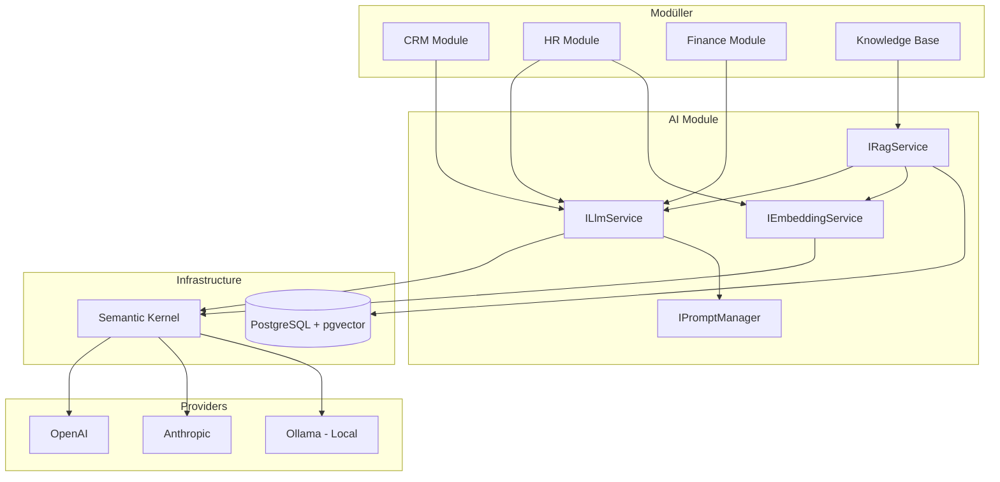

# EntApp.Framework — AI Entegrasyon Stratejisi

> **Tarih:** 2026-03-28  
> **Bağımlılık:** [Mimari Spesifikasyon](file:///c:/Users/kaya/projects/EntApp.Framework/docs/enterprise-framework-evaluation.md), [Business Framework](file:///c:/Users/kaya/projects/EntApp.Framework/docs/business-framework-layer.md)  
> **Durum:** Tasarım tartışması

---

## 1. Framework'te AI Nerede Durur?

Tıpkı Business Framework gibi, AI da katmanlı düşünülmeli:

```
┌─────────────────────────────────────────────────────┐
│  Module-Specific AI (modül içi AI kullanımları)      │
│  CRM: lead scoring, Sales: tahminleme, HR: CV analiz │
├─────────────────────────────────────────────────────┤
│  AI Module (framework seviyesi ortak altyapı)        │
│  LLM Gateway, Embedding, RAG, Prompt Mgmt, Vector   │
├─────────────────────────────────────────────────────┤
│  Business Framework (CustomerBase, OrderBase...)     │
├─────────────────────────────────────────────────────┤
│  Technical Framework (CQRS, UoW, Events, Auth...)   │
└─────────────────────────────────────────────────────┘
```

**AI Module** = cross-cutting, tüm modüllerin kullanabileceği ortak AI altyapısı  
**Module-Specific AI** = her modülün kendi AI özelliklerini ekleyebildiği extension noktaları

---

## 2. AI Module — Framework Altyapısı

### Proje Yapısı

```
Modules/
└── AI/
    ├── AI.Domain/
    │   ├── Entities/
    │   │   ├── AiModel.cs              (kayıtlı model tanımları)
    │   │   ├── PromptTemplate.cs       (versiyonlu prompt şablonları)
    │   │   ├── EmbeddingDocument.cs     (vektör DB'ye indekslenmiş dokümanlar)
    │   │   ├── AiUsageLog.cs           (maliyet takibi, token kullanımı)
    │   │   └── AiConversation.cs       (chat geçmişi)
    │   └── Enums/
    │       ├── AiProvider.cs           (OpenAI, Anthropic, Ollama, AzureOpenAI)
    │       └── EmbeddingModel.cs       (text-embedding-3-small, nomic-embed vb.)
    │
    ├── AI.Application/
    │   ├── Interfaces/
    │   │   ├── ILlmService.cs          (provider-agnostic LLM abstraction)
    │   │   ├── IEmbeddingService.cs    (metin → vektör)
    │   │   ├── IRagService.cs          (retrieve + generate)
    │   │   ├── IPromptManager.cs       (şablon yönetimi)
    │   │   └── IDocumentProcessor.cs   (PDF/Office → metin çıkarma)
    │   ├── Commands/
    │   │   ├── IndexDocument/          (dokümanı vektör DB'ye ekle)
    │   │   ├── GenerateText/           (serbest metin üretimi)
    │   │   ├── AnalyzeDocument/        (doküman analizi)
    │   │   └── Chat/                   (konuşma tabanlı AI)
    │   └── Queries/
    │       ├── SemanticSearch/         (vektör benzerlik araması)
    │       └── GetAiUsageStats/        (maliyet raporu)
    │
    ├── AI.Infrastructure/
    │   ├── Providers/
    │   │   ├── OpenAiProvider.cs
    │   │   ├── AnthropicProvider.cs
    │   │   ├── AzureOpenAiProvider.cs
    │   │   └── OllamaProvider.cs       (self-hosted, yerel model)
    │   ├── Embeddings/
    │   │   └── PgVectorStore.cs        (PostgreSQL + pgvector)
    │   ├── DocumentProcessing/
    │   │   ├── PdfExtractor.cs
    │   │   └── OfficeExtractor.cs
    │   └── SemanticKernel/
    │       └── SemanticKernelService.cs (Microsoft Semantic Kernel entegrasyonu)
    │
    └── AI.API/
        ├── ChatController.cs
        ├── SearchController.cs
        └── DocumentController.cs
```

### Temel Servisler

| Servis | Ne yapar | Kullanım |
|--------|----------|----------|
| **ILlmService** | Metin üretimi, sınıflandırma, özetleme | Her modül kullanabilir |
| **IEmbeddingService** | Metin → vektör dönüşümü | Semantic search, benzerlik |
| **IRagService** | Doküman bazlı soru-cevap | Knowledge base, help desk |
| **IPromptManager** | Versiyonlu prompt şablonları | Prompt'ları koddan ayırır |
| **IDocumentProcessor** | PDF/Office → düz metin | Doküman indeksleme |

---

## 3. Teknoloji Seçimleri

### LLM Orchestration: Microsoft Semantic Kernel

| | Semantic Kernel | LangChain.NET |
|---|---|---|
| **Geliştirici** | Microsoft (resmi) | Topluluk portu |
| **Dil** | C# native | Python'dan port |
| **.NET entegrasyonu** | 1st class | 2nd class |
| **Plugin sistemi** | Güçlü (OpenAI function calling) | Var ama daha az olgun |
| **DI uyumu** | Tam (IServiceCollection) | Sınırlı |
| **Olgunluk** | Üretim hazır | Geliştirme aşamasında |
| **Destek** | Microsoft LTS | Topluluk |

**Seçim: Semantic Kernel** — .NET native, Microsoft destekli, DI uyumlu, plugin sistemi güçlü.

### Vector Database: PostgreSQL + pgvector

Ayrı bir vector DB (Pinecone, Qdrant, Weaviate) yerine **pgvector** kullanmak:

- ✅ Ek altyapı yok — zaten PostgreSQL kullanıyoruz
- ✅ SQL ile sorgulama + vektör araması aynı query'de
- ✅ Tenant izolasyonu (TenantId ile filtreleme) doğal çalışır
- ✅ Transaction desteği — embedding kaydetme ve metadata aynı tx'te
- ⚠️ 10M+ vektör üzeri ölçekte Qdrant/Milvus'a göre yavaşlayabilir (çoğu kurumsal uygulama için yeterli)

```sql
-- pgvector ile örnek
CREATE TABLE embedding_documents (
    id UUID PRIMARY KEY,
    tenant_id UUID NOT NULL,
    module_name VARCHAR(50),       -- "CRM", "HR", "KnowledgeBase"
    content TEXT,
    embedding VECTOR(1536),        -- OpenAI text-embedding-3-small
    metadata JSONB,
    created_at TIMESTAMPTZ
);

-- Semantic search
SELECT content, 1 - (embedding <=> $query_vector) AS similarity
FROM embedding_documents
WHERE tenant_id = $tenant_id
ORDER BY embedding <=> $query_vector
LIMIT 10;
```

---

## 4. Modül Bazlı AI Kullanım Senaryoları

### CRM
| Özellik | Nasıl çalışır |
|---------|--------------|
| **Lead Scoring** | Müşteri verisi (işlem geçmişi, etkileşim) → LLM ile skor tahmini |
| **Müşteri Özeti** | Tüm aktiviteler + notlar → otomatik müşteri özeti üretimi |
| **E-posta Taslağı** | Müşteri bağlamı + prompt → kişiselleştirilmiş e-posta taslağı |
| **Churn Tahmini** | Son 90 gün etkileşim verisi → risk skoru |

### Sales
| Özellik | Nasıl çalışır |
|---------|--------------|
| **Talep Tahmini** | Geçmiş sipariş verisi → gelecek dönem satış tahmini |
| **Fiyat Önerisi** | Müşteri segmenti + geçmiş alımlar → optimal iskonto önerisi |
| **Sipariş Anomalisi** | Normalden sapan siparişleri tespit (miktar, tutar) |

### HR
| Özellik | Nasıl çalışır |
|---------|--------------|
| **CV Analizi** | PDF CV → yapılandırılmış veri çıkarma (ad, beceri, deneyim) |
| **Pozisyon Eşleştirme** | CV embedding ↔ iş ilanı embedding → benzerlik skoru |
| **Performans Özeti** | Değerlendirme notları → otomatik performans raporu |

### Finance
| Özellik | Nasıl çalışır |
|---------|--------------|
| **Fatura OCR** | Fatura görseli → yapılandırılmış fatura verisi (tutar, tarih, KDV) |
| **Anomali Tespiti** | Normal ödeme kalıplarından sapma → uyarı |
| **Nakit Akış Tahmini** | Geçmiş gelir/gider → gelecek 30/60/90 gün projeksiyonu |

### Knowledge Base & Help Desk
| Özellik | Nasıl çalışır |
|---------|--------------|
| **RAG Soru-Cevap** | Dokümanları indele → kullanıcı sorusuna dokümandan yanıt üret |
| **Ticket Sınıflandırma** | Destek talebi metni → otomatik kategori + öncelik atama |
| **Yanıt Önerisi** | Ticket içeriği + bilgi bankası → agent'a yanıt taslağı |

### Audit & Reporting
| Özellik | Nasıl çalışır |
|---------|--------------|
| **Doğal Dil Sorgu** | "Bu ay en çok sipariş veren 10 müşteri" → SQL üretimi → sonuç |
| **Rapor Özetleme** | Tablo verisi → insan-okunabilir yönetici özeti |

---

## 5. AI Entegrasyon Mimarisi



### Provider Abstraction

```csharp
// Framework'te — provider-agnostic interface
public interface ILlmService
{
    Task<string> GenerateAsync(string prompt, LlmOptions? options = null);
    Task<T> GenerateStructuredAsync<T>(string prompt);  // JSON output
    Task<string> SummarizeAsync(string content);
    Task<string> ClassifyAsync(string content, string[] categories);
    IAsyncEnumerable<string> StreamAsync(string prompt); // streaming
}

// Konfigürasyonla provider seçimi
// appsettings.json:
// "AI": { "DefaultProvider": "OpenAI", "FallbackProvider": "Ollama" }
```

### Modüller AI'ı Nasıl Kullanır — 3 Pattern

#### Pattern A: MediatR ile Senkron İstek (En yaygın)

Modüller, AI modülüne `Shared.Contracts` üzerinden MediatR sorgusu gönderir:

```csharp
// Shared.Contracts/Ai/ — tüm modüller kullanabilir
public record AiCompletionQuery(string Prompt, string Context) : IRequest<Result<string>>;
public record AiClassificationQuery(string Text, string[] Categories) : IRequest<Result<string>>;
public record AiSummaryQuery(string Text, int MaxLength = 200) : IRequest<Result<string>>;
public record AiEffortEstimateQuery(string Title, string Description) : IRequest<Result<int>>;
public record AiSemanticSearchQuery(string Query, string Collection, int TopK = 5) : IRequest<Result<List<SearchResult>>>;
```

```csharp
// CRM modülü — müşteri özeti üretimi
public class GenerateCustomerSummaryHandler : IRequestHandler<...>
{
    public async Task<Result<string>> Handle(...)
    {
        var activities = await _repo.GetCustomerActivities(customerId);
        var summary = await _mediator.Send(new AiSummaryQuery(activities.ToText()));
        return summary;
    }
}
```

#### Pattern B: Integration Event ile Asenkron (Ağır İşlemler)

Uzun süren AI işlemleri (toplu test üretimi, doküman indeksleme) event ile tetiklenir:

```csharp
// Gereksinim onaylandığında → AI test senaryosu taslağı üretsin (arka planda)
public record RequirementApprovedIntegrationEvent(Guid RequirementId, string Title, string Description) 
    : IIntegrationEvent;

// AI modülünde consumer — arka planda çalışır
public class RequirementApprovedConsumer : IConsumer<RequirementApprovedIntegrationEvent>
{
    public async Task Consume(...)
    {
        var scenarios = await _llm.GenerateStructuredAsync<TestScenarioSuggestion[]>(...);
        
        // Sonucu TestManagement modülüne gönder
        await _eventBus.PublishAsync(new AiTestScenariosGeneratedEvent(
            RequirementId: context.Message.RequirementId,
            SuggestedScenarios: scenarios  // Taslak olarak kaydedilir, QA onaylar
        ));
    }
}
```

#### Pattern C: IAiService Interface (Doğrudan DI Kullanımı)

Basit çağrılar için doğrudan inject:

```csharp
public interface IAiService
{
    Task<string> CompleteAsync(string prompt, CancellationToken ct = default);
    Task<string> SummarizeAsync(string text, int maxLength = 200, CancellationToken ct = default);
    Task<string[]> ClassifyAsync(string text, string[] categories, CancellationToken ct = default);
    Task<float[]> EmbedAsync(string text, CancellationToken ct = default);
    Task<List<SearchResult>> SemanticSearchAsync(string query, string collection, int topK = 5, CancellationToken ct = default);
}
```

> [!NOTE]
> **Pattern seçimi:** Basit sınıflandırma/özetleme → Pattern A (MediatR). Ağır üretim işleri (test senaryosu, release note) → Pattern B (Event). Utility çağrısı → Pattern C (IAiService).

---

## 6. UI — AI Etkileşim Noktaları

### 6a. AI Asistan Paneli (Floating Chat — Tüm Sayfalarda)

Sağ alt köşede her sayfada erişilebilir floating panel. Sayfa bağlamını (hangi modül, hangi entity, hangi proje) otomatik algılar:

```
┌──────────────────────────────────────────┐
│  🤖 AI Asistan                     [✕]  │
├──────────────────────────────────────────┤
│                                          │
│  User: Bu sprint'te riskli item'lar      │
│        hangileri?                         │
│                                          │
│  AI: Sprint 5'te 2 riskli item var:      │
│  • US-12 "Login yenileme" — 8 SP,        │
│    bağımlılık: US-45 henüz bitmedi       │
│  • BUG-89 "Ödeme hatası" — blocker,      │
│    3 gündür InProgress                   │
│                                          │
│  [Daha fazla detay]  [US-12'ye git]      │
│                                          │
├──────────────────────────────────────────┤
│  [Mesaj yazın...                    ▶]  │
└──────────────────────────────────────────┘
```

- Doğal dil ile soru sorma → RAG ile cevap (wiki, gereksinim, backlog arama)
- Sonuçlar tıklanabilir link olarak gelir
- Streaming response (token token gösterim)

### 6b. Inline AI Önerileri (Form Alanlarında)

Form doldurulurken AI, ilgili alanlar için otomatik öneri getirir:

```
┌─ Yeni Backlog Item ──────────────────────────────┐
│                                                   │
│ Başlık: [Kullanıcı login sayfası yenile___]      │
│                                                   │
│ Story Points: [  ]  🤖 AI Önerisi: 5 SP          │
│                     (Benzer: US-34=5SP, US-67=3SP)│
│                                                   │
│ Öncelik:  [Medium ▼] 🤖 Öneri: High              │
│                       (3 bağımlı item mevcut)     │
│                                                   │
│              [Kaydet]  [AI ile Zenginleştir 🤖]   │
└───────────────────────────────────────────────────┘
```

### 6c. AI Aksiyonları (Buton / Context Menu)

Entity detay sayfalarında bağlama uygun AI aksiyonları sunulur:

| Sayfa | AI Aksiyonları |
|-------|---------------|
| **Backlog Item detay** | Test senaryosu üret, Efor tahmini yap, Kabul kriteri öner, Benzer item'ları bul |
| **Gereksinim detay** | Özetle, İş kuralı çıkar, Teknik doküman taslağı oluştur |
| **Ticket detay** | Yanıt öner, Benzer ticket bul, Öncelik/kategori öner |
| **Release detay** | Release note üret |
| **Wiki sayfa** | İçerik özetle, Çevir, İlgili sayfaları öner |
| **Proje dashboard** | Sprint risk analizi, Kaynak önerisi |

### 6d. Arka Plan AI (Kullanıcı Farkında Olmadan)

| Tetikleyici | AI İşlemi | Sonuç |
|------------|-----------|-------|
| Ticket oluşturuldu | Metin analizi → kategori + öncelik tahmini | Form alanlarına öneri olarak yerleşir |
| Gereksinim onaylandı | Test senaryosu taslakları üret | QA'nın onayına taslak olarak düşer |
| Release planlandı | Backlog item'lardan release note üret | PM'in düzenlemesine taslak gelir |
| Wiki sayfası kaydedildi | Embedding üret → pgvector'a kaydet | Semantic search'te bulunabilir olur |
| Ticket kapandı | Çözüm özetini çıkar | Knowledge base'e öneri olarak ekle |

> [!IMPORTANT]
> **AI önerileri her zaman "öneri" olarak sunulur.** Otomatik kesinleştirme yapılmaz. Kullanıcı öneriyi kabul eder, değiştirir veya reddeder.

---

## 7. Frontend AI Bileşenleri

```
frontend/src/components/ai/
├── AiAssistantPanel.tsx       → Floating chat paneli (tüm sayfalarda)
├── AiSuggestionBadge.tsx      → Form alanı yanında AI önerisi gösterici
├── AiActionButton.tsx         → "AI ile Zenginleştir" butonu
├── AiActionMenu.tsx           → Context menu (test üret, özetle, çevir...)
├── AiSearchBar.tsx            → Semantic search input
├── AiStreamingText.tsx        → Streaming LLM response gösterimi
├── AiLoadingIndicator.tsx     → AI işleniyor animasyonu (pulsing dot)
└── hooks/
    ├── useAiCompletion.ts     → AI completion API hook (streaming)
    ├── useAiSuggestion.ts     → Inline öneri hook (debounced, 500ms)
    └── useAiSearch.ts         → Semantic search hook
```

### AI API Endpoint'leri

```
POST   /api/v1/ai/complete           → Serbest prompt tamamlama
POST   /api/v1/ai/summarize          → Metin özetleme
POST   /api/v1/ai/classify           → Sınıflandırma
POST   /api/v1/ai/embed              → Embedding üretme
POST   /api/v1/ai/search             → Semantic search (RAG)
POST   /api/v1/ai/chat               → Konuşma tabanlı AI (streaming SSE)
POST   /api/v1/ai/suggest/effort     → Efor tahmini (backlog item context)
POST   /api/v1/ai/suggest/tests      → Test senaryosu üretimi
POST   /api/v1/ai/suggest/release-note → Release note üretimi
GET    /api/v1/ai/usage              → Token kullanım istatistikleri
```

---

## 8. Prompt Management

Prompt'lar kodda sabit string olmamalı. Versiyonlanabilir, test edilebilir, runtime'da değiştirilebilir olmalı.

```
PromptTemplate tablosu:
┌──────────┬──────────────────────┬─────────┬───────────────────────────┐
│ Key      │ Module               │ Version │ Template                  │
├──────────┼──────────────────────┼─────────┼───────────────────────────┤
│ customer │ CRM                  │ 2       │ "Aşağıdaki müşteri       │
│ -summary │                      │         │  aktivitelerini özetle:   │
│          │                      │         │  {{activities}}"          │
├──────────┼──────────────────────┼─────────┼───────────────────────────┤
│ ticket   │ HelpDesk             │ 1       │ "Bu destek talebini       │
│ -classify│                      │         │  sınıflandır: ..."        │
└──────────┴──────────────────────┴─────────┴───────────────────────────┘
```

- Her modül kendi prompt'larını tanımlar
- Prompt'lar DB'de tutulur, admin panel'den düzenlenebilir
- A/B test: aynı key'e 2 versiyon → hangisi daha iyi sonuç veriyor

---

## 9. Maliyet Kontrolü

| Mekanizma | Açıklama |
|-----------|----------|
| **Usage Logging** | Her LLM çağrısı: modül, token sayısı, maliyet, süre |
| **Rate Limiting** | Modül/tenant bazlı günlük/aylık token limiti |
| **Model Routing** | Basit işler → küçük/ucuz model, karmaşık işler → büyük model |
| **Caching** | Aynı prompt + input → cache'ten dön (Redis) |
| **Fallback** | OpenAI down → Anthropic → Ollama (yerel) |

---

## 10. On-Premise / Privacy Seçeneği

Kurumsal müşteriler verilerinin dışarı çıkmasını istemeyebilir:

| Mod | Provider | Veri nereye gider |
|-----|----------|-------------------|
| **Cloud** | OpenAI / Anthropic | Dış API'ye gönderilir |
| **Hybrid** | Azure OpenAI | Azure bölgesinde kalır, KVKK uyumlu |
| **On-premise** | Ollama (Llama 3, Mistral) | Hiçbir veri dışarı çıkmaz |

Framework **provider-agnostic** olduğu için `appsettings.json`'dan provider değişir, kod değişmez.

---

## 11. Geliştirme Fazları

| Faz | İçerik | Ne zaman |
|-----|--------|----------|
| **Faz 1** | AI Module altyapı: ILlmService, IEmbeddingService, Semantic Kernel, pgvector, prompt management | Faz 2 (Core Modules) ile birlikte |
| **Faz 2** | RAG pipeline: doküman indeksleme, semantic search | Knowledge Base modülü ile birlikte |
| **Faz 3** | Modül-spesifik AI: CRM scoring, HR CV analizi, Finance OCR | İlgili iş modülü geliştirildikçe |
