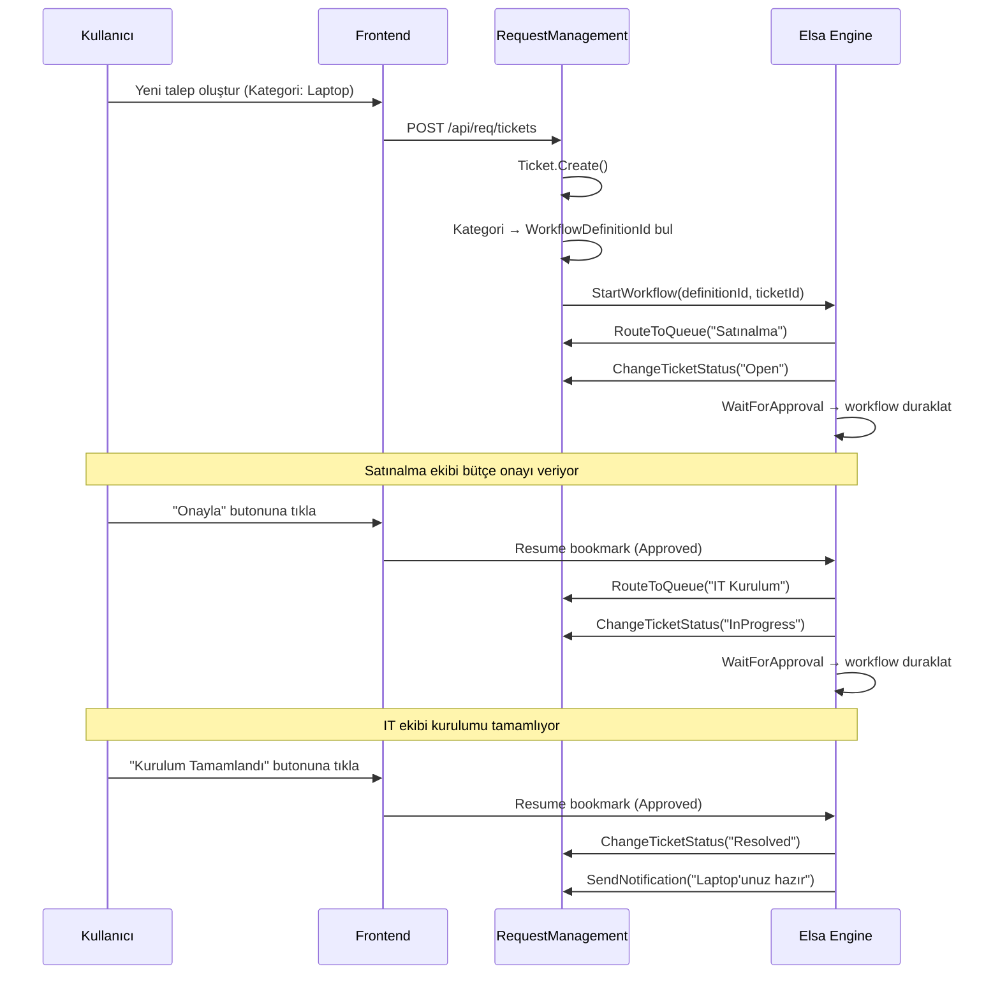

# Elsa Workflow Entegrasyonu — Talep Yaşam Döngüsü Yönetimi

> **Tarih:** Nisan 2026  
> **Durum:** Planlama  
> **İlgili Modüller:** Workflow, RequestManagement

---

## 1. Vizyon

Mevcut homegrown Workflow modülü (onay adımları odaklı) **Elsa Workflows v3** ile değiştirilecektir. Elsa, .NET projesine doğrudan embed edilebilen, görsel workflow designer sunan, açık kaynak (MIT) bir workflow engine'dir.

**Hedef:** Tenant yöneticileri, **görsel workflow designer** aracılığıyla talep yaşam döngüsü akışlarını tasarlayıp devreye alabilecek. Kod yazmaya gerek kalmadan basit onay ve durum geçiş akışları oluşturulabilecek.

```
┌─────────────────────────────────────────────────────────────────┐
│  Tenant Yönetimi → Workflows menüsü                            │
│  ┌─────────────────────────────────────────────────────────┐    │
│  │  📋 Tanımlı Workflow'lar Listesi                        │    │
│  │  ┌─────────────┬──────────┬──────────┬───────────────┐  │    │
│  │  │ Ad          │ Kategori │ Durum    │ Aksiyonlar    │  │    │
│  │  ├─────────────┼──────────┼──────────┼───────────────┤  │    │
│  │  │ IT Talep    │ IT       │ ● Aktif  │ Düzenle │ ... │  │    │
│  │  │ İzin Onayı  │ HR       │ ● Aktif  │ Düzenle │ ... │  │    │
│  │  │ VPN Erişim  │ IT       │ ○ Taslak │ Düzenle │ ... │  │    │
│  │  └─────────────┴──────────┴──────────┴───────────────┘  │    │
│  │  [+ Yeni Workflow Oluştur]                               │    │
│  └─────────────────────────────────────────────────────────┘    │
│                                                                  │
│  Düzenle tıklanınca → Elsa Studio Designer (embedded)            │
│  ┌─────────────────────────────────────────────────────────┐    │
│  │  🎨 Görsel Workflow Designer (Elsa Studio)              │    │
│  │  ┌──────┐    ┌───────────┐    ┌──────────┐             │    │
│  │  │ Yeni ├───→│ İşlemde   ├───→│ Çözüldü  │             │    │
│  │  └──────┘    └─────┬─────┘    └────┬─────┘             │    │
│  │                    │               │                     │    │
│  │              ┌─────▼─────┐   ┌─────▼─────┐             │    │
│  │              │ Eskalasyon│   │  Kapalı   │             │    │
│  │              └───────────┘   └───────────┘             │    │
│  └─────────────────────────────────────────────────────────┘    │
└─────────────────────────────────────────────────────────────────┘
```

---

## 2. Mimari Büyük Resim

### 2.1 Mevcut Durum vs Hedef

| Katman | Mevcut | Hedef |
|--------|--------|-------|
| **Engine** | Homegrown (WorkflowDefinition + WorkflowInstance + ApprovalStep) | **Elsa Workflows v3** (MIT, NuGet) |
| **Designer** | Yok — workflow JSON elle yazılıyor | **Elsa Studio** (Blazor-based görsel editor) |
| **Persistence** | Kendi tablolarımız (wf schema) | Elsa'nın built-in EF Core + PostgreSQL desteği |
| **Multi-tenancy** | Kendi ITenantEntity yapımız | Elsa'nın `Elsa.Tenants` modülü — ClaimsTenantResolver |
| **Ticket bağlantısı** | `Ticket.WorkflowInstanceId` (pasif) | Elsa custom activities + integration events |

### 2.2 Elsa Yerleşim Stratejisi

```
                    EntApp.WebAPI (Host)
                    ┌───────────────────────────────────────┐
                    │  Program.cs                           │
                    │  services.AddElsa(elsa => {            │
                    │    elsa.UseWorkflowManagement()        │
                    │    elsa.UseWorkflowRuntime()           │
                    │    elsa.UseWorkflowsApi()              │
                    │    elsa.UseEntityFrameworkPostgreSql()  │
                    │    elsa.UseTenants()                   │
                    │    elsa.AddActivitiesFrom<              │
                    │      TicketManagementFeature>()        │
                    │  })                                    │
                    └───────┬───────────────────────────────┘
                            │
              ┌─────────────┼────────────────────┐
              │             │                    │
    ┌─────────▼──────┐  ┌──▼──────────┐  ┌──────▼──────────┐
    │ Elsa Core       │  │ Elsa Studio │  │ Custom Activities│
    │ (NuGet packages)│  │ (Blazor RCL)│  │ (our module)     │
    │                 │  │ /workflows  │  │                  │
    │ • Runtime       │  │ route       │  │ • ChangeStatus   │
    │ • Management    │  │             │  │ • AssignTicket   │
    │ • Persistence   │  │ embedded in │  │ • SendNotify     │
    │ • Tenants       │  │ Next.js via │  │ • CheckSLA       │
    │ • HTTP/Webhooks │  │ iframe/wasm │  │ • WaitForApproval│
    └─────────────────┘  └─────────────┘  └─────────────────┘
```

### 2.3 Elsa Studio Frontend Entegrasyonu

Frontend Next.js olduğu için Elsa Studio (Blazor) entegrasyonu 2 seçenekle mümkün:

| Yaklaşım | Açıklama | Avantaj | Dezavantaj |
|-----------|----------|---------|------------|
| **A) iframe embed** | Elsa Studio ayrı Blazor app olarak ayağa kalkar, `/manage/workflows` sayfasında iframe ile gösterilir | Basit, izole, güncelleme kolay | İki ayrı hosting, iframe UX sınırları |
| **B) WASM npm** | `@elsa-workflows/elsa-studio-wasm` npm paketi ile Next.js'e custom element olarak embed | Tek uygulama, native hissi | Daha karmaşık setup, bundle size |

**Öneri:** Faz 1'de **iframe embed** (hızlı, izole, çalışır), Faz 2+'da opsiyonel olarak WASM entegrasyonuna geçilebilir.

---

## 3. Detaylı Bileşenler

### 3.1 Custom Activities (Ticket Yönetimi)

Elsa'ya entegre edilecek **özel aktiviteler** — workflow designer'da sürükle-bırak olarak kullanılacak:

```
📦 Ticket Management (Activity Category)
├── 🔄 ChangeTicketStatus
│   Input:  TicketId, NewStatus, Reason
│   Output: Success/Failure
│   Outcomes: [StatusName] — her statü ayrı çıkış portu
│
├── 👤 AssignTicket
│   Input:  TicketId, AssigneeUserId | AssigneeRole
│   Output: AssignedUserId
│
├── ⏳ WaitForApproval
│   Input:  TicketId, ApproverUserId | ApproverRole, TimeoutHours
│   Output: Decision (Approved/Rejected), Comment
│   Blocking: ✅ (workflow duraklar, user aksiyonu bekler)
│
├── 📧 SendNotification
│   Input:  TicketId, RecipientUserId | RecipientRole, Template
│   Output: NotificationId
│
├── ⏱️ CheckSLA
│   Input:  TicketId
│   Output: ResponseBreached, ResolutionBreached, TimeRemaining
│   Outcomes: [OK, ResponseBreached, ResolutionBreached]
│
├── 🔀 RouteToQueue
│   Input:  TicketId, QueueId | QueueCode
│   Output: RoutedQueueId
│
├── 📝 AddComment
│   Input:  TicketId, Content, IsInternal
│   Output: CommentId
│
└── 🎫 GetTicketDetails
    Input:  TicketId
    Output: TicketData (status, priority, category, queue, etc.)
```

### 3.2 Kavram: Workflow = Uçtan Uca Yaşam Döngüsü

> **ÖNEMLİ:** Workflow, tek bir queue'daki süreç DEĞİLDİR. Workflow, talebin başlangıçtan
> bitişe tüm yaşam döngüsünü kapsar ve **birden fazla queue'yu orkestrasyona alabilir**.

| Kavram | Tanım | Örnek |
|--------|-------|-------|
| **Workflow** | Uçtan uca süreç orchestration'ı | "Laptop Talebi Akışı" — satınalma + kurulum + teslimat |
| **Queue** | Workflow'un bir **aşamasında** işi yapan ekip | "Satınalma Ekibi", "IT Kurulum Ekibi" |
| **RouteToQueue** | Workflow içindeki aktivite — ticket'ı bir sonraki queue'ya taşır | Satınalma bitti → IT Kurulum'a yönlendir |
| **Kategori** | Workflow'u belirleyen birincil bağlayıcı | "Laptop Talebi" kategorisi → "Laptop Akışı" workflow'u |

### 3.3 Örnek 1: Basit Akış — "Yazıcı Sorunu" (tek queue)

```
[Ticket Created]
    → [RouteToQueue: "IT Destek"]
    → [ChangeStatus: "Open"]
    → [AssignTicket: Queue Lead]
    → [WaitForApproval: "Değerlendirme"]
        ├── Approved → [ChangeStatus: "InProgress"]
        │              → [WaitForApproval: "Çözüm Onayı"]
        │                  ├── Approved → [ChangeStatus: "Resolved"]
        │                  └── Rejected → [ChangeStatus: "InProgress"]
        └── Rejected → [ChangeStatus: "Cancelled"]
```

### 3.4 Örnek 2: Çok Queue'lu Akış — "Yeni Laptop Talebi" (satınalma → kurulum)

```
[Ticket Created]
    → [ChangeStatus: "Open"]
    │
    ├── AŞAMA 1: Satınalma
    │   → [RouteToQueue: "Satınalma"]
    │   → [AssignTicket: Queue Lead]
    │   → [WaitForApproval: "Bütçe Onayı"]
    │       ├── Rejected → [ChangeStatus: "Cancelled"] → [END]
    │       └── Approved
    │           → [ChangeStatus: "InProgress"]
    │           → [AddComment: "Satınalma onaylandı, sipariş veriliyor"]
    │           → [WaitForApproval: "Sipariş Teslim Alındı"]
    │               └── Approved
    │
    ├── AŞAMA 2: IT Kurulum
    │   → [RouteToQueue: "IT Kurulum"]
    │   → [AssignTicket: "IT Teknisyen" role]
    │   → [ChangeStatus: "InProgress"]
    │   → [WaitForApproval: "Kurulum Tamamlandı"]
    │       └── Approved
    │           → [AddComment: "Cihaz hazır, teslim ediliyor"]
    │
    └── BİTİŞ
        → [SendNotification: "Laptop'unuz hazır"]
        → [ChangeStatus: "Resolved"]
```

Bu örnekte **tek workflow** 2 farklı queue'yu sıralı olarak kullanıyor. Her queue aşamasında farklı ekip farklı işleri yapıyor, ama hepsi **aynı workflow instance** tarafından orkestre ediliyor.

### 3.5 Ticket ↔ Workflow Bağlantı Modeli

**Binding:** `RequestCategory.DefaultWorkflowDefinitionId` — **sadece kategori bazlı**.

Queue'ya workflow bağlamaya gerek yok çünkü workflow'un kendisi hangi queue'lardan geçeceğini zaten biliyor (`RouteToQueue` aktiviteleri ile).

```
RequestCategory ("Laptop Talebi")
    └── DefaultWorkflowDefinitionId → "laptop-talep-akisi"
                                        │
                                        ├── RouteToQueue("Satınalma")  ← Aşama 1
                                        ├── RouteToQueue("IT Kurulum") ← Aşama 2
                                        └── ChangeStatus("Resolved")   ← Son
```



### 3.6 Frontend — Aksiyonlar Paneli (Dinamik)

Ticket detay sayfasındaki "Aksiyonlar" bölümü workflow'dan dinamik olarak beslenecek:

**Mevcut (statik):**
```
Aksiyonlar
├── Durum Değiştir: [Dropdown: tüm durumlar] [Uygula]
```

**Hedef (workflow-driven):**
```
Aksiyonlar
├── 🟢 Onayla  ← WaitForApproval aktivitesinden gelen aksiyon
├── 🔴 Reddet  ← WaitForApproval aktivitesinden gelen aksiyon
├── 💬 Bilgi İste ← workflow'un sunduğu opsiyonel geçiş
└── ⬆️ Eskale Et ← workflow'un sunduğu opsiyonel geçiş
```

Elsa'nın "blocking activities" mekanizması burada kullanılır. `WaitForApproval` bir bookmark oluşturur, frontend bu bookmark'ın detaylarını API'den çeker ve uygun butonları gösterir.

---

## 4. Teknik Uygulama Planı

### Faz 1: Elsa Core Entegrasyonu

**Amaç:** Elsa engine'i backend'e entegre etmek, custom activities oluşturmak, Elsa Studio'yu iframe ile göstermek.

#### Backend

| # | İş | Dosya | Açıklama |
|---|-----------|-------|----------|
| 1 | NuGet paketleri | Host `.csproj` | `Elsa` (v3.6+), `Elsa.Workflows.Api`, `Elsa.EntityFrameworkCore.PostgreSql`, `Elsa.Tenants` |
| 2 | Elsa servis kaydı | `Program.cs` | `services.AddElsa(...)` — runtime, management, API, persistence, tenants |
| 3 | Elsa DB schema | Otomatik | Elsa kendi migration'larını çalıştırır (`elsa` schema) |
| 4 | Tenant resolver | `ElsaTenantResolver.cs` | Mevcut `TenantResolutionMiddleware`'den resolve edilen tenant'ı Elsa'ya aktarır |
| 5 | Custom activities | `Activities/*.cs` | `ChangeTicketStatus`, `AssignTicket`, `WaitForApproval`, `SendNotification`, `CheckSLA`, `RouteToQueue`, `AddComment`, `GetTicketDetails` |
| 6 | Feature kayıt | `TicketManagementFeature.cs` | Tüm custom activities'i Elsa'ya kaydeder |
| 7 | Mevcut WF modülü | Deprecate | Homegrown WorkflowDefinition/Instance/ApprovalStep → sonra kaldırılacak |

#### Frontend

| # | İş | Dosya | Açıklama |
|---|-----------|-------|----------|
| 8 | Workflows menüsü | `/manage/workflows/page.tsx` | Elsa API'den workflow definition listesini çeker, listeler |
| 9 | Designer embed | `/manage/workflows/[id]/page.tsx` | Elsa Studio Blazor app → iframe embed |
| 10 | Yeni workflow | `/manage/workflows/new/page.tsx` | Yeni workflow oluştur → Elsa Studio designer |
| 11 | Sidebar menü | `layout.tsx` | Tenant Yönetimi altına "İş Akışları" menüsü |

#### Elsa Studio (Standalone Blazor App)

| # | İş | Açıklama |
|---|-----------|----------|
| 12 | Blazor projesi | `src/Host/EntApp.WorkflowDesigner/` — Elsa Studio Razor Class Library host |
| 13 | Port yapılandırma | `localhost:5280` — Elsa Studio API endpoint |
| 14 | Auth integration | Cookie/JWT paylaşımı veya API key ile backend'e erişim |
| 15 | Next.js proxy | `next.config.ts` — `/elsa-studio/*` → `localhost:5280` rewrite |

---

### Faz 2: Ticket ↔ Workflow Entegrasyonu

**Amaç:** Ticket oluşturulunca otomatik workflow başlatma, aksiyonlar panelini workflow-driven yapma.

#### Workflow Bağlama Modeli

Workflow **sadece kategori bazlı** bağlanır. Queue'ya workflow atamaya gerek yok — workflow'un kendisi hangi queue'lardan geçeceğini `RouteToQueue` aktiviteleri ile belirler.

```
RequestCategory.DefaultWorkflowDefinitionId → workflow'u belirler
    │
    └── Workflow içindeki RouteToQueue aktiviteleri → queue geçişlerini yönetir

ServiceQueue.DefaultWorkflowDefinitionId → KALDIRILACAK (gereksiz)
```

> **Domain değişiklikleri:**
> - `RequestCategory` entity'sine `Guid? DefaultWorkflowDefinitionId` property **eklenir**
> - `ServiceQueue.DefaultWorkflowDefinitionId` property sonraki fazda **kaldırılır** (Elsa geçişi tamamlanınca)

| # | İş | Açıklama |
|---|-----------|-------|
| 16 | `RequestCategory` güncelleme | `DefaultWorkflowDefinitionId` property + migration |
| 17 | Ticket → Workflow bağlama | `CreateTicketHandler` → Kategori'nin `DefaultWorkflowDefinitionId`'si varsa Elsa workflow instance başlat, `ticket.LinkWorkflow()` |
| 18 | Allowed actions API | `GET /api/req/tickets/{id}/actions` → Elsa'dan ticket'a ait aktif workflow instance'ın mevcut blocking activity'lerini sorgula, frontend'e buton listesi olarak dön |
| 19 | Action execution | `POST /api/req/tickets/{id}/actions/{actionId}` → Elsa bookmark'ını resume et (onay/red/bilgi isteği) |
| 20 | Frontend aksiyonlar | `[id]/page.tsx` → statik dropdown yerine dinamik aksiyon butonları |
| 21 | Fallback | Workflow bağlı olmayan ticket'larda (kategoride workflow tanımsız) basit enum-based state machine geçişleri |

### Faz 3: Gelişmiş Özellikler

| # | İş | Açıklama |
|---|-----------|----------|
| 22 | Timer activities | SLA breach yaklaşınca otomatik eskalasyon, auto-close idle tickets |
| 23 | Conditional branching | Priority-based akış dallanması (Critical → hızlı yol, Low → standart yol) |
| 24 | Dashboard | Workflow analytics — ortalama çözüm süresi, bottleneck analizi |
| 25 | Workflow templates | Hazır şablonlar — "Standart IT Talebi", "VPN Erişim Onayı", "İzin Talebi" |

---

## 5. NuGet Paketleri

```xml
<!-- Host projesine eklenecek paketler -->
<PackageReference Include="Elsa" Version="3.6.0" />
<PackageReference Include="Elsa.Workflows.Api" Version="3.6.0" />
<PackageReference Include="Elsa.EntityFrameworkCore.PostgreSql" Version="3.6.0" />
<PackageReference Include="Elsa.Tenants" Version="3.6.0" />
<PackageReference Include="Elsa.Identity" Version="3.6.0" />
<PackageReference Include="Elsa.Http" Version="3.6.0" />
<PackageReference Include="Elsa.Scheduling" Version="3.6.0" />

<!-- Elsa Studio (ayrı Blazor projesi) -->
<PackageReference Include="Elsa.Studio" Version="3.6.0" />
<PackageReference Include="Elsa.Studio.Shell" Version="3.6.0" />
```

> **Not:** Version numaraları implementasyon sırasında NuGet.org'dan doğrulanmalıdır.

---

## 6. DB Schema Stratejisi

```
┌─────────────────────────────────────────┐
│  PostgreSQL: entapp_dev                 │
│                                          │
│  req.*    → RequestManagement tabloları  │
│  org.*    → Organization tabloları       │
│  iam.*    → IAM tabloları               │
│  wf.*     → Mevcut homegrown (deprecate)│
│  elsa.*   → Elsa Workflows tabloları    │  ← YENİ
│            (definitions, instances,      │
│             bookmarks, triggers, etc.)   │
└─────────────────────────────────────────┘
```

Elsa kendi migration'larını yönetir — `elsa` schema altında tablolar oluşturur.

---

## 7. Multi-Tenancy Entegrasyonu

Elsa v3 built-in multi-tenancy destekler. Entegrasyon:

```csharp
services.AddElsa(elsa =>
{
    elsa.UseTenants(tenants =>
    {
        // Mevcut TenantResolutionMiddleware'den resolve edilen tenant'ı kullan
        tenants.UseClaimsTenantResolver();
        // veya custom resolver:
        tenants.UseTenantResolver<EntAppTenantResolver>();
    });
});
```

Bu sayede:
- Her tenant kendi workflow definition'larını tanımlar
- Workflow instance'lar tenant-isolated
- Elsa Studio designer tenant context'inde çalışır

---

## 8. Mevcut Workflow Modülü Geçiş Planı

Homegrown modül → Elsa geçişi:

| Adım | İş | Detay |
|------|-----------|-------|
| 1 | Elsa entegre et | Homegrown modülle paralel çalışır |
| 2 | Custom activities yaz | ChangeTicketStatus, WaitForApproval vb. |
| 3 | Yeni akışlar Elsa ile | Yeni ticket workflow'ları Elsa designer'da oluşturulur |
| 4 | Mevcut akışları migrate et | Homegrown definition'ları Elsa definition'a çevir |
| 5 | Homegrown modülü deprecate | `WorkflowDefinition`, `WorkflowInstance`, `ApprovalStep` → soft-delete |
| 6 | Homegrown modülü kaldır | DB tablolarını archive'la, kodu sil |

> **Geçiş süresi boyunca** her iki sistem paralel çalışabilir. Ticket, ya Elsa ya homegrown workflow'a bağlı olabilir — `WorkflowInstanceId` alanı her iki durumu da destekler.

---

## 9. Dosya Yapısı (Hedef)

```
src/
├── Host/
│   ├── EntApp.WebAPI/               ← Mevcut host + Elsa kaydı
│   └── EntApp.WorkflowDesigner/     ← YENİ: Elsa Studio Blazor host
│       ├── Program.cs
│       ├── App.razor
│       └── EntApp.WorkflowDesigner.csproj
│
├── Modules/
│   └── Workflow/
│       ├── EntApp.Modules.Workflow.Domain/
│       │   ├── Entities/            ← Mevcut (deprecate planlanıyor)
│       │   └── Activities/          ← YENİ: Elsa custom activities
│       │       ├── ChangeTicketStatus.cs
│       │       ├── AssignTicket.cs
│       │       ├── WaitForApproval.cs
│       │       ├── SendNotification.cs
│       │       ├── CheckSLA.cs
│       │       ├── RouteToQueue.cs
│       │       ├── AddComment.cs
│       │       └── GetTicketDetails.cs
│       ├── EntApp.Modules.Workflow.Application/
│       │   └── Features/
│       │       └── TicketManagementFeature.cs  ← Elsa Feature kaydı
│       └── EntApp.Modules.Workflow.Infrastructure/
│           ├── ElsaTenantResolver.cs           ← Tenant ↔ Elsa mapping
│           └── ElsaIntegrationEventHandlers.cs ← Elsa events → RM events
│
├── Frontend/
│   └── entapp-web/
│       └── src/app/manage/
│           └── workflows/           ← YENİ: Workflow yönetim sayfaları
│               ├── page.tsx         ← Workflow listesi
│               ├── [id]/
│               │   └── page.tsx     ← Elsa Studio designer (iframe)
│               └── new/
│                   └── page.tsx     ← Yeni workflow oluştur
```

---

## 10. Riskler ve Önlemler

| Risk | Etki | Önlem |
|------|------|-------|
| Elsa v3 breaking changes | Yüksek | Version lock + semver takibi |
| Blazor iframe UX kısıtları | Orta | Custom wrapper + postMessage API |
| Tenant isolation güvenliği | Yüksek | E2E tenant test'leri |
| Elsa schema migration conflict | Orta | Ayrı `elsa` schema, kendi migration'ları |
| Performance (büyük workflow instance sayısı) | Düşük | Elsa built-in pagination + archiving |
| Mevcut homegrown workflow data migration | Orta | Paralel çalışma dönemi + migration script |

---

## 11. Başarı Kriterleri

- [ ] Tenant yöneticisi görsel designer ile yeni workflow oluşturabilmeli
- [ ] Oluşturulan workflow bir ticket kategorisine/queue'ya atanabilmeli
- [ ] Ticket oluşturulunca atanmış workflow otomatik başlamalı
- [ ] Ticket detay sayfasında aksiyonlar workflow'dan gelmeli (statik değil)
- [ ] WaitForApproval durumunda kullanıcı onayla/reddet yapabilmeli
- [ ] Workflow tamamlanınca ticket otomatik "Resolved" olmalı
- [ ] Multi-tenant izolasyon çalışmalı (Tenant A'nın workflow'ları B'ye görünmemeli)
