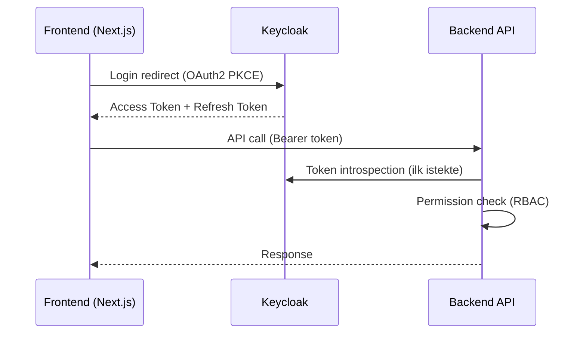

# EntApp.Framework — Kesinleşmiş Mimari Spesifikasyon

> **Tarih:** 2026-03-28  
> **Durum:** ✅ Tüm kararlar alındı — geliştirmeye hazır  
> **Kaynak:** [modular-monolith-reference-modules.md](file:///c:/Users/kaya/projects/EntApp.Framework/modular-monolith-reference-modules.md)

## Proje Vizyonu

**EntApp.Framework**, kurumsal uygulamalar için **yeniden kullanılabilir başlangıç noktası (starter kit)** olarak tasarlanmış bir modüler monolit framework'tür. Sıfırdan uygulama geliştirmek yerine, bu framework clone/fork edilerek yeni projelere temel oluşturur.

- **Modül açma/kapama:** İş modülleri (CRM, HR, Finance vb.) projeye göre dahil edilir veya çıkarılır. Çekirdek altyapı her zaman kalır.
- **Convention-based discovery:** Yeni modül eklendiğinde DI, migration ve endpoint keşfi otomatik çalışır.
- **Scaffolding-ready:** İleride `dotnet new entapp-module --name Sales` ile boilerplate kodun otomatik üretilmesi hedeflenir.
- **Self-contained dokümantasyon:** Her modül kendi README'si, API kontratı ve event listesiyle birlikte gelir.

---

## 1. Teknoloji Yığını (Kesinleşmiş)

### Backend

| Katman | Teknoloji | Versiyon |
|--------|-----------|----------|
| **Runtime** | .NET 9 (STS) | 9.x |
| **API** | ASP.NET Core (Controller + Minimal API) | — |
| **ORM** | EF Core (TPT Kalıtım Stratejisi) | 9.x |
| **Veritabanı** | PostgreSQL | 16+ |
| **Cache** | Redis | 7.x |
| **Message Bus** | MassTransit + **RabbitMQ** (Başlangıç) / **Kafka** (Ölçeklenme) | — |
| **Background Jobs** | Hangfire (PostgreSQL storage) | — |
| **Auth** | Keycloak (self-hosted, Docker) | 24+ |
| **Real-time** | SignalR | — |
| **Mediator** | MediatR | 12.x |
| **Validation** | FluentValidation | — |
| **Mapping** | Mapster | — |
| **Logging** | Serilog + Seq | — |
| **API Docs** | Swagger / Scalar (OpenAPI) | — |
| **Testing** | xUnit + NSubstitute + Testcontainers | — |
| **Health Check** | AspNetCore.Diagnostics.HealthChecks | — |

### Frontend

| Katman | Teknoloji |
|--------|-----------|
| **Framework** | React 19 + TypeScript |
| **Meta Framework** | Next.js 15 (App Router) |
| **API Client & Type Gen**| **Orval** (OpenAPI'den TS Type ve Axios hook otomatik üretimi) |
| **UI Components** | **shadcn/ui** + Radix UI primitives |
| **Styling** | Tailwind CSS 4 |
| **State (server)** | TanStack Query v5 |
| **State (client)** | Zustand |
| **Forms** | React Hook Form + Zod |
| **Data Grid** | TanStack Table (shadcn table üzerine) |
| **Charts** | Recharts |
| **i18n** | next-intl |
| **Icons** | Lucide React |
| **Tema** | next-themes (dark/light) |

### DevOps & Altyapı

| Alan | Teknoloji |
|------|-----------|
| **Container** | Docker + Docker Compose |
| **Orchestration** | Kubernetes (production) |
| **CI/CD** | Azure DevOps Pipelines |
| **Monitoring** | Prometheus + Grafana |
| **Tracing** | OpenTelemetry + Jaeger |
| **API Gateway** | YARP (.NET tabanlı reverse proxy) |
| **Secret Management** | Azure Key Vault |
| **Workflow Engine** | Elsa Workflows 3.x (.NET native, gömülü) |

### docker-compose.yml servisleri
```yaml
services:
  postgres:     # Ana veritabanı
  redis:        # Distributed cache + session
  rabbitmq:     # Message bus (Başlangıç için varsayılan, düşük memory)
  keycloak:     # Auth server
  seq:          # Log arama ve analiz
  jaeger:       # Distributed tracing
  # kafka:      # (Opsiyonel - İleride yüksek throughput gerektiğinde)
```

> [!NOTE]
> **Neden Başlangıçta RabbitMQ?** Modüler monolit yapısında, modüller aynı process içinde çalışırken başlangıçta Kafka kullanmak geliştirme ortamında gereksiz bir operasyonel yüktür (RAM ve yönetim). MassTransit sayesinde önce RabbitMQ (veya In-Memory) ile başlanır. İleride bir modül bağımsız servise çıkarıldığında kod değişmeden sadece MassTransit Kafka transport'una geçilir.

---

## 2. Deployment Mimarisi — Hybrid Yaklaşım

### Strateji: Modüler Monolit + Microservice-Ready

Framework, **tek deploy** olarak başlar ama ileride modüllerin **bağımsız servise çıkarılmasına** hazır tasarlanır. Bunu sağlayan kurallar:

### Modüller Arası İletişim Kuralları

```csharp
// ✅ DOĞRU: Modüller arası iletişim — SADECE MediatR üzerinden
var project = await _mediator.Send(new GetProjectQuery(projectId));

// ✅ DOĞRU: Event ile bildirim — SADECE Integration Events
await _eventBus.PublishAsync(new TicketCreatedEvent(ticket.Id));

// ❌ YANLIŞ: Başka modülün DbContext'ine direkt erişim
var project = await _projectDbContext.Projects.FindAsync(projectId);

// ❌ YANLIŞ: Başka modülün internal servisini inject etme
var result = _projectService.GetById(projectId);
```

> [!IMPORTANT]
> **Altın kural:** Bir modül, başka bir modülün verisine yalnızca **MediatR (Query/Command)** veya **Integration Events** ile erişir. Direkt DbContext veya servis erişimi YASAKTIR. Bu kural sayesinde ileride herhangi bir modül bağımsız servise çıkarıldığında, MediatR çağrısı HTTP/gRPC'ye, event ise Kafka mesajına dönüştürülür — iş mantığı değişmez.

### Modül Sınırları

```
Her modül kendi:
  ├── Domain/        → Entity, ValueObject, DomainEvent
  ├── Application/   → Commands, Queries, Handlers, Contracts (interface)
  ├── Infrastructure/→ EF DbContext, Repository impl, External services
  └── API/           → Controller/Endpoint

Paylaşılan:
  ├── Shared.Kernel/       → BaseEntity, Result, ortak ValueObjects
  ├── Shared.Contracts/    → Cross-module Query/Command/Event tanımları
  └── Shared.Infrastructure/ → Pipeline, Middleware, Auth, Cache
```

### İleride Modül Çıkarma (Extraction)

```
Faz 1 (şimdi): Tek process, tek DB
  RequestModule ──MediatR──► ProjectModule
                    ↓
              Aynı PostgreSQL

Faz 2 (gerekirse): Modül ayrılır
  RequestService ──HTTP/gRPC──► ProjectService
                      ↓              ↓
              PostgreSQL_1    PostgreSQL_2

Değişen: Sadece Infrastructure katmanı (MediatR → HTTP client)
Değişmeyen: Domain, Application katmanları, iş mantığı
```

### Frontend Yaklaşımı

**Micro-frontend gerekli değil.** Tek Next.js App Router ile modül bazlı klasör yapısı:

```
src/
├── app/                        → Next.js route'ları (modül bazlı)
│   ├── (dashboard)/
│   ├── requests/
│   ├── projects/
│   ├── requirements/
│   └── admin/
├── features/                   → Modüle özel bileşenler ve hook'lar
│   ├── requests/components/
│   ├── projects/components/
│   └── ...
├── components/                 → Paylaşılan UI bileşenleri
│   ├── StatusBadge, KanbanBoard, GanttChart ...
└── stores/                     → Paylaşılan state (auth, notification)
```

**Gerekçe:** Modüller arası yoğun cross-navigation (ticket → proje → gereksinim → test), ortak state (auth, bildirim), ortak design system. Micro-frontend bu bağlamlarda karmaşıklık ekler, değer üretmez.

> [!NOTE]
> **Ne zaman micro-frontend'e geçilir?** 10+ bağımsız ekip, modüller tamamen bağımsız ürün olarak satılacaksa, veya farklı frontend teknolojileri kullanılacaksa. Bu durumda Webpack 5 Module Federation tercih edilir.

---

## 3. Onaylanan Mimari Pattern'ler

### 2.1. ✅ CQRS (Command Query Responsibility Segregation)

Her modülün `Application` katmanı:

```
Module.Application/
├── Commands/
│   ├── CreateOrder/
│   │   ├── CreateOrderCommand.cs        ← IRequest<Result<Guid>>
│   │   ├── CreateOrderCommandHandler.cs ← IRequestHandler<>
│   │   └── CreateOrderCommandValidator.cs ← AbstractValidator<>
│   └── ...
├── Queries/
│   ├── GetOrderById/
│   │   ├── GetOrderByIdQuery.cs         ← IRequest<Result<OrderDto>>
│   │   └── GetOrderByIdQueryHandler.cs
│   └── GetOrdersPaged/
│       ├── GetOrdersPagedQuery.cs       ← IRequest<Result<PagedResult<OrderDto>>>
│       └── GetOrdersPagedQueryHandler.cs
├── DTOs/
├── EventHandlers/                       ← Domain Event handler'ları
├── Interfaces/
└── Mappings/
```

**Request akışı:**
```
Controller → _mediator.Send(Command/Query)
  → [ValidationBehavior] → [LoggingBehavior] → [PerformanceBehavior]
    → [TransactionBehavior] (Command) / [CachingBehavior] (Query)
      → Handler → UnitOfWork.SaveChanges → Domain Events → Integration Events
```

### 2.2. ✅ Unit of Work

- EF Core `DbContext` = built-in UoW
- Her modülün kendi `DbContext`'i var — modüller arası transaction yok
- `SaveChangesAsync()` → tek transaction, atomik commit
- Domain event'ler commit sonrası dispatch edilir
- Integration event'ler Outbox tablosuna yazılır (aynı transaction)

### 2.3. ✅ Pipeline Behaviors (MediatR)

```
Request ──► [1] ValidationBehavior      (Command + Query — FluentValidation)
           ──► [2] LoggingBehavior      (Command + Query — Serilog)
              ──► [3] PerformanceBehavior (Command + Query — >500ms warning)
                 ──► [4] TransactionBehavior (sadece Command — begin/commit/rollback)
                    ──► [5] CachingBehavior   (sadece Query — Redis, ICacheableQuery<T>)
                       ──► Handler
                          ──► Response
```

**Aktivasyon:**
- Global: Validation, Logging, Performance — her request
- Marker interface: `ICacheableQuery<T>` → CachingBehavior
- Attribute: `[Transactional]` → TransactionBehavior

### 2.4. ✅ Domain Events vs Integration Events

| | Domain Event | Integration Event |
|---|---|---|
| **Kapsam** | Modül-içi | Modüller-arası |
| **Transport** | MediatR `INotification` | MassTransit → RabbitMQ (başlangıç) / Kafka (ölçeklenme) |
| **Transaction** | Aynı transaction | Outbox → ayrı transaction |
| **Fail** | Rollback | Retry + dead-letter queue |
| **Tanım yeri** | `Module.Domain/Events/` | `Shared.Contracts/Events/` |

**Yaşam döngüsü:**
```
Handler: entity.AddDomainEvent(new OrderCreatedEvent(...))
  → SaveChangesAsync()
    → EF Interceptor (pre-commit): domain event'leri topla → _mediator.Publish()
      → DomainEventHandler (aynı modül, aynı transaction)
        → Gerekirse: _eventBus.Publish(IntegrationEvent)
          → Outbox tablosuna yaz (aynı tx)
    → SaveChangesAsync (post-commit):
      → OutboxProcessor → RabbitMQ publish (arka plan worker)
```

> [!NOTE]
> **Domain Event Dispatch Zamanlaması:** Domain event'ler **pre-commit** aşamasında dispatch edilir (aynı transaction). Bu sayede domain event handler'daki işlemler başarısız olursa tüm transaction rollback olur. Integration event'ler ise Outbox'a yazılıp **post-commit** aşamasında arka plan worker ile publish edilir.

**Örnekler:**

| Modül | Domain Event | Integration Event |
|-------|-------------|-------------------|
| IAM | `UserPasswordChangedEvent` | `UserCreatedIntegrationEvent` → HR, Notification |
| Sales | `OrderItemAddedEvent` | `OrderCompletedIntegrationEvent` → Finance, Inventory |
| Finance | `PaymentReceivedEvent` | `InvoiceApprovedIntegrationEvent` → Notification |
| HR | `LeaveApprovedEvent` | `EmployeeTerminatedIntegrationEvent` → IAM |
| Workflow | `StepCompletedEvent` | `ApprovalCompletedIntegrationEvent` → kaynak modül |

> [!CAUTION]
> Domain event handler'ı **asla başka modülün DB'sine yazmamalı**. Modül sınırı geçilecekse → Integration Event.

### 2.5. ✅ Outbox Pattern

Integration event'ler doğrudan message bus'a yayınlanmaz. Önce aynı transaction içinde `OutboxMessage` tablosuna yazılır, ardından arka plan worker ile RabbitMQ'ya (ileride Kafka'ya) publish edilir. Bu, **at-least-once delivery** garantisi sağlar.

> [!IMPORTANT]
> **Idempotency:** At-least-once delivery, aynı event'in birden fazla tüketilmesine neden olabilir. Tüm `IIntegrationEvent`'ler `Guid IdempotencyKey` taşır. Consumer tarafında `ProcessedEvents` tablosu ile daha önce işlenmiş event'ler filtrelenir.

```
OutboxMessages tablosu (her modülün kendi şemasında):
┌─────────┬───────────────────┬──────────────┬───────────┬─────────────┐
│ Id      │ EventType         │ Payload (JSON)│ CreatedAt │ ProcessedAt │
└─────────┴───────────────────┴──────────────┴───────────┴─────────────┘
```

### 2.6. ✅ Result Pattern

Handler'lar asla exception fırlatmaz (iş mantığı hataları için). Bunun yerine `Result<T>` döner:

```
Result<T>
├── IsSuccess / IsFailure
├── Value (başarılıysa T)
├── Error (başarısızsa Error nesnesi)
└── Errors (validasyon hataları listesi)
```

Bu sayede controller'da:
```
var result = await _mediator.Send(command);
return result.IsSuccess ? Ok(result.Value) : BadRequest(result.Errors);
```

### 2.7. ✅ Saga / Process Manager (uzun süren işlemler)

Modüller arası çok adımlı işlemler (örn: sipariş → stok düşümü → fatura oluşturma) için MassTransit Saga state machine kullanılır:

```
OrderSaga States:
  [Submitted] → OrderCompleted → [StockReserved] → StockConfirmed
    → [InvoiceCreated] → InvoiceConfirmed → [Completed]
  
  Herhangi bir adımda hata → Compensating actions (rollback)
```

---

## 3. Proje Yapısı (Güncellenmiş)

```
EntApp.Framework/
│
├── src/
│   ├── Shared/
│   │   ├── Shared.Kernel/
│   │   │   ├── BaseEntity.cs            (Id, CreatedAt, UpdatedAt, IsDeleted, RowVersion, _domainEvents)
│   │   │   ├── AuditableEntity.cs       (CreatedBy, ModifiedBy)
│   │   │   ├── AggregateRoot.cs         (domain event yönetimi)
│   │   │   ├── ITenantEntity.cs         (TenantId)
│   │   │   ├── IDomainEvent.cs          (marker: INotification)
│   │   │   ├── Result.cs               (Result<T>, Error)
│   │   │   ├── StronglyTypedId.cs       (EntityId<T> base record struct)
│   │   │   ├── ValueObjects/            (Money, DateRange, Address, Email, PhoneNumber)
│   │   │   ├── Enums/                   (Status, Priority vb.)
│   │   │   ├── Specifications/          (ISpecification<T>, SpecificationEvaluator)
│   │   │   └── Exceptions/             (DomainException, NotFoundException)
│   │   │
│   │   ├── Shared.Contracts/
│   │   │   ├── Events/                  (integration event kontratları)
│   │   │   │   ├── IIntegrationEvent.cs
│   │   │   │   ├── UserCreatedIntegrationEvent.cs
│   │   │   │   ├── OrderCompletedIntegrationEvent.cs
│   │   │   │   └── ...
│   │   │   ├── DTOs/                    (modüller arası paylaşılan DTO'lar)
│   │   │   │   ├── UserInfoDto.cs
│   │   │   │   ├── TenantInfoDto.cs
│   │   │   │   └── ...
│   │   │   └── Interfaces/
│   │   │       ├── ICurrentUser.cs
│   │   │       ├── ICurrentTenant.cs
│   │   │       ├── IEventBus.cs
│   │   │       └── IUnitOfWork.cs
│   │   │
│   │   └── Shared.Infrastructure/
│   │       ├── Persistence/
│   │       │   ├── BaseDbContext.cs      (audit, soft delete, tenant filter, domain event dispatch, AsSplitQuery)
│   │       │   ├── OutboxProcessor.cs   (integration event → RabbitMQ publish)
│   │       │   └── ProcessedEventStore.cs (idempotency — işlenmiş event filtresi)
│   │       ├── Behaviors/               (MediatR pipeline)
│   │       │   ├── ValidationBehavior.cs
│   │       │   ├── LoggingBehavior.cs
│   │       │   ├── PerformanceBehavior.cs
│   │       │   ├── TransactionBehavior.cs
│   │       │   └── CachingBehavior.cs
│   │       ├── Auth/
│   │       │   ├── KeycloakTokenService.cs
│   │       │   └── PermissionAuthorizationHandler.cs
│   │       ├── Caching/
│   │       │   ├── ICacheService.cs
│   │       │   ├── RedisCacheService.cs
│   │       │   └── CacheKeyBuilder.cs
│   │       ├── EventBus/
│   │       │   ├── RabbitMqEventBus.cs   (MassTransit + RabbitMQ transport)
│   │       │   └── InMemoryEventBus.cs  (geliştirme/test)
│   │       ├── Middleware/
│   │       │   ├── TenantResolutionMiddleware.cs
│   │       │   ├── ExceptionHandlingMiddleware.cs  (RFC 7807 ProblemDetails)
│   │       │   ├── RateLimitingMiddleware.cs
│   │       │   ├── AuditMiddleware.cs
│   │       │   └── RequestLoggingMiddleware.cs
│   │       ├── HealthChecks/
│   │       │   └── ModuleHealthCheck.cs
│   │       └── Extensions/
│   │           └── ServiceCollectionExtensions.cs
│   │
│   ├── Modules/
│   │   │
│   │   │── ── Çekirdek (Core) ──────────────────────────
│   │   │
│   │   ├── IAM/
│   │   │   ├── IAM.Domain/              (User, Role, Permission, Organization)
│   │   │   ├── IAM.Application/         (Commands/, Queries/, DTOs/, EventHandlers/)
│   │   │   ├── IAM.Infrastructure/      (EF DbContext, Keycloak connector)
│   │   │   └── IAM.API/                 (controllers, endpoints)
│   │   │
│   │   ├── Notification/
│   │   │   ├── Notification.Domain/     (NotificationTemplate, NotificationLog)
│   │   │   ├── Notification.Application/
│   │   │   ├── Notification.Infrastructure/  (SMTP, SMS, SignalR, Push)
│   │   │   └── Notification.API/
│   │   │
│   │   ├── FileManagement/
│   │   │   ├── FileManagement.Domain/   (FileEntry, FileVersion, FileTag)
│   │   │   ├── FileManagement.Application/
│   │   │   ├── FileManagement.Infrastructure/  (S3, Azure Blob, local)
│   │   │   └── FileManagement.API/
│   │   │
│   │   ├── Audit/
│   │   │   ├── Audit.Domain/            (AuditLog, EntityChange, LoginRecord)
│   │   │   ├── Audit.Application/
│   │   │   ├── Audit.Infrastructure/
│   │   │   └── Audit.API/
│   │   │
│   │   ├── Configuration/
│   │   │   ├── Configuration.Domain/    (AppSetting, FeatureFlag)
│   │   │   ├── Configuration.Application/
│   │   │   ├── Configuration.Infrastructure/
│   │   │   └── Configuration.API/
│   │   │
│   │   │── ── İş Süreçleri (Business) ──────────────────
│   │   │
│   │   ├── Workflow/                    (Elsa Workflows 3.x entegre)
│   │   ├── TaskManagement/
│   │   ├── CRM/
│   │   ├── HR/
│   │   ├── Finance/
│   │   ├── Inventory/
│   │   ├── Procurement/
│   │   ├── Sales/
│   │   ├── MerchantManagement/
│   │   ├── ConsumerManagement/
│   │   ├── Loyalty/
│   │   ├── DigitalSales/
│   │   └── ServiceDelivery/             (opsiyonel)
│   │   │
│   │   │── ── İletişim & Raporlama ─────────────────────
│   │   │
│   │   ├── Messaging/
│   │   ├── Calendar/
│   │   ├── KnowledgeBase/
│   │   ├── Reporting/
│   │   └── DataExchange/
│   │   │
│   │   │── ── Entegrasyon ──────────────────────────────
│   │   │
│   │   ├── IntegrationHub/
│   │   └── ApiManagement/
│   │   │
│   │   │── ── Altyapı (Cross-Cutting) ──────────────────
│   │   │
│   │   ├── MultiTenancy/
│   │   ├── Localization/
│   │   └── BackgroundJobs/              (Hangfire)
│   │   │
│   │   │── ── Opsiyonel ───────────────────────────────
│   │   │
│   │   ├── FieldService/
│   │   ├── HelpDesk/
│   │   └── Survey/
│   │
│   └── Host/
│       └── WebAPI/
│           ├── Program.cs               (composition root)
│           ├── ModuleRegistration.cs     (IModuleInstaller convention-based auto-discovery)
│           ├── appsettings.json
│           ├── appsettings.Development.json
│           ├── appsettings.Production.json
│           └── Dockerfile
│
├── frontend/
│   ├── src/
│   │   ├── app/                         (Next.js App Router)
│   │   │   ├── (auth)/                  (login, register — Keycloak redirect)
│   │   │   ├── (dashboard)/             (ana dashboard)
│   │   │   ├── [module]/                (dinamik modül routing)
│   │   │   ├── layout.tsx
│   │   │   └── providers.tsx            (QueryClient, ThemeProvider, AuthProvider)
│   │   ├── components/
│   │   │   ├── ui/                      (shadcn/ui bileşenleri)
│   │   │   ├── layouts/                 (sidebar, header, breadcrumb)
│   │   │   ├── data-table/              (generic CRUD tablo)
│   │   │   ├── forms/                   (dynamic form builder)
│   │   │   └── shared/                  (ortak bileşenler)
│   │   ├── lib/
│   │   │   ├── api/                     (axios/fetch instance, interceptors)
│   │   │   ├── hooks/                   (custom hooks)
│   │   │   ├── stores/                  (Zustand stores)
│   │   │   └── utils/                   (helpers)
│   │   ├── types/                       (TypeScript type definitions)
│   │   └── styles/
│   │       └── globals.css              (Tailwind + shadcn tema)
│   ├── public/
│   ├── next.config.ts
│   ├── tailwind.config.ts
│   ├── components.json                  (shadcn/ui config)
│   └── package.json
│
├── tests/
│   ├── Modules/                         (her modülün unit testleri)
│   ├── Integration/                     (modüller arası testler)
│   └── Shared/TestHelpers/
│
├── database/
│   ├── Migrations/                      (modül başına alt klasör: IAM/, CRM/, ...)
│   ├── Seeds/
│   │   ├── Core/                        (framework seeds — roller, yetkiler, ülkeler)
│   │   └── Demo/                        (geliştirme ortamı demo verileri)
│   └── Scripts/
│
├── docs/
│   ├── Architecture.md
│   ├── ModuleGuide.md
│   ├── API/                             (OpenAPI export'ları)
│   └── Database/                        (ER diyagramları)
│
├── docker-compose.yml
├── docker-compose.override.yml          (geliştirme ortamı)
├── .editorconfig
├── Directory.Build.props
└── EntApp.sln
```

---

## 4. Multi-Tenancy Stratejisi

**Seçim:** Row-level isolation (TenantId) — başlangıç için en pratik.

```
Her entity:  ITenantEntity { Guid TenantId }
EF Core:    Global Query Filter → .HasQueryFilter(e => e.TenantId == _currentTenant.Id)
Middleware: TenantResolutionMiddleware → header/subdomain/claim'den tenant belirle
```

İleride schema-per-tenant'a geçiş `BaseDbContext` değişikliğiyle mümkün.

---

## 5. Auth Mimarisi (Keycloak)



- **Frontend:** `next-auth` veya `keycloak-js` ile token yönetimi
- **Backend:** JWT validation middleware + custom `PermissionAuthorizationHandler`
- **SSO:** LDAP/AD bağlantısı Keycloak tarafında yapılandırılır
- **MFA:** Keycloak built-in TOTP/WebAuthn

---

## 6. Modüller Arası Bağımlılık Haritası

```
IAM ──────────────► HER MODÜL (zorunlu)
Notification ─────► HER MODÜL (opsiyonel)
Audit ────────────► HER MODÜL (cross-cutting, middleware)
MultiTenancy ─────► HER MODÜL (EF Global Filter)

Workflow ─────► Task, Procurement, HR, Finance, Sales, MerchantManagement
Calendar ─────► HR, Task, CRM, MerchantManagement
Reporting ────► TÜM iş modülleri (read-only veri kaynağı)
Integration ──► Finance, CRM, HR, Inventory (dış sistem bağlantıları)

CRM ──► ConsumerManagement (B2B2C)
ConsumerManagement ──► MerchantManagement, Loyalty, DigitalSales
Sales ──► Inventory (stok düşümü) ──► Finance (fatura)
MerchantManagement ──► Finance, Reporting, Workflow, Calendar
```

---

## 7. Geliştirme Fazları

### Faz 1 — Foundation (2-3 hafta)
| İş | Detay |
|----|-------|
| Shared.Kernel | BaseEntity, AggregateRoot, Result, ValueObjects, IDomainEvent |
| Shared.Contracts | IIntegrationEvent, IEventBus, ICurrentUser, ICurrentTenant, IUnitOfWork |
| Shared.Infrastructure | BaseDbContext (AsSplitQuery), Behaviors (5 adet), Middleware (5 adet, RFC 7807 + RateLimiting), RabbitMqEventBus, RedisCacheService, OutboxProcessor + ProcessedEventStore |
| Host/WebAPI | Program.cs, ModuleRegistration (IModuleInstaller auto-discovery), Docker Compose (Postgres, Redis, RabbitMQ, Keycloak, Seq, Jaeger) |
| Frontend scaffold | Next.js 15 + shadcn/ui + Tailwind + providers + layout (sidebar, header) |

### Faz 2 — Core Modules (4-6 hafta)
| Modül | Öncelik |
|-------|---------|
| IAM | 🔴 Kritik — Keycloak entegrasyonu, RBAC, org yapısı |
| Configuration | 🔴 Kritik — feature flags, app settings |
| Audit | 🔴 Kritik — tüm modüller bağımlı |
| Notification | 🔴 Kritik — SignalR real-time hub dahil |
| FileManagement | 🟡 Yüksek — diğer modüller dosya ekleyecek |
| MultiTenancy | 🔴 Kritik — tüm modüller TenantId kullanacak, tenant bootstrapper dahil |
| Localization | 🟡 Yüksek — UI çeviri altyapısı |
| Admin Panel | 🟡 Yüksek — framework yönetim ekranı |

### Faz 3 — Business Modules (modül başına 2-4 hafta)
```
Workflow → CRM → HR → Finance → Inventory → Sales → Procurement
```

### Faz 4 — İletişim & Raporlama
```
Messaging → Calendar → KnowledgeBase → Reporting → DataExchange
```

### Faz 5 — Entegrasyon & Opsiyonel
```
IntegrationHub → ApiManagement → MerchantManagement → ConsumerManagement
→ Loyalty → DigitalSales → FieldService → HelpDesk → Survey
```

### Faz 6 — Geliştirici Araçları
```
CLI Scaffolding (dotnet new entapp-module)
```

---

## 8. Ek Mimari Kararlar

### 8.1. ✅ Real-time Notification Hub (SignalR)

Entity değişikliklerinin ilgili kullanıcılara canlı olarak iletilmesi:

```
Entity değişti (SaveChanges) 
  → Integration Event 
    → NotificationHub (SignalR)
      → İlgili kullanıcıların ekranı güncellenir
```

**Framework altyapısı:**

```
Shared.Infrastructure/
├── RealTime/
│   ├── IRealtimeHub.cs              (abstraction)
│   ├── EntAppHub.cs                 (SignalR hub — tek merkezi hub)
│   ├── EntityChangeNotifier.cs      (entity değişikliğini push et)
│   └── UserConnectionTracker.cs     (hangi kullanıcı hangi entity'yi izliyor)
```

| Senaryo | Ne olur |
|---------|---------|
| Kullanıcı A sipariş oluşturdu | Kullanıcı B'nin sipariş listesi canlı güncellenir |
| Yönetici izin talebini onayladı | Çalışanın ekranında toast + badge güncellenir |
| Konfigürasyon değişti | Tüm aktif oturumlara bildirim gider |

**Dynamic UI entegrasyonu:** `DynamicTable` SignalR'a subscribe olur → yeni kayıt eklendiğinde tablo otomatik yenilenir, silinen kayıt soluklaşıp kaybolur.

### 8.2. ✅ Temporal Data / Change History

Audit log "kim ne yaptı" sorusuna cevap verir. Temporal data ise **"bu kaydın 3 ay önceki hali neydi?"** sorusuna cevap verir.

```csharp
// Framework attribute'ü
[Temporal]  // bu entity'nin tüm versiyonları tutulur
public class Contract : AuditableEntity
{
    public string Title { get; set; }
    public decimal Amount { get; set; }
    public ContractStatus Status { get; set; }
}

// Otomatik oluşan history tablosu
// contracts_history (id, title, amount, status, valid_from, valid_to)
```

**Implementasyon:** PostgreSQL temporal tables veya EF Core `SaveChanges` interceptor ile `_history` tablosuna otomatik yazma.

**API:**
```
GET /api/contract/{id}/history        → tüm versiyonlar
GET /api/contract/{id}/at?date=...    → belirli tarihteki hal
GET /api/contract/{id}/diff/{v1}/{v2} → iki versiyon arası fark
```

### 8.3. ✅ Tenant Bootstrapper

Yeni tenant oluşturulduğunda otomatik seed data yüklenmesi:

```
Yeni Tenant oluşturuldu (TenantCreatedEvent)
  → IAM: varsayılan roller (Admin, Manager, User, ReadOnly)
  → IAM: admin kullanıcı
  → Configuration: varsayılan app settings
  → Localization: varsayılan dil paketleri
  → Lookup: ülke, şehir, para birimi (opsiyonel)
```

```csharp
// Her modül kendi seed'ini tanımlar
public interface ITenantSeeder
{
    int Order { get; }  // çalışma sırası (IAM önce, diğerleri sonra)
    Task SeedAsync(Guid tenantId);
}

// IAM modülü
public class IamTenantSeeder : ITenantSeeder
{
    public int Order => 1;
    public async Task SeedAsync(Guid tenantId)
    {
        // Admin role, default permissions, admin user oluştur
    }
}
```

### 8.4. ✅ API Versioning

```
URL-based:    /api/v1/customers    /api/v2/customers
Header-based: X-Api-Version: 2
```

**Kütüphane:** `Asp.Versioning.Http`

**Kurallar:**
- Framework API'leri `v1` ile başlar
- Breaking change → yeni versiyon, eski versiyon en az 6 ay desteklenir
- Deprecated endpoint'ler `Sunset` header ile bildirilir
- OpenAPI dokümanı versiyon başına ayrı oluşturulur

### 8.5. ✅ CLI Scaffolding

Yeni modül eklerken tüm boilerplate'i otomatik oluşturan `dotnet new` template:

```bash
dotnet new entapp-module --name Procurement --group "İş Süreçleri"
```

**Oluşturduğu yapı:**
```
Modules/Procurement/
├── Procurement.Domain/
│   ├── Entities/
│   ├── Events/
│   ├── Enums/
│   └── Procurement.Domain.csproj
├── Procurement.Application/
│   ├── Commands/
│   ├── Queries/
│   ├── DTOs/
│   ├── EventHandlers/
│   ├── Interfaces/
│   └── Procurement.Application.csproj
├── Procurement.Infrastructure/
│   ├── Persistence/ProcurementDbContext.cs
│   └── Procurement.Infrastructure.csproj
├── Procurement.API/
│   ├── Controllers/
│   └── Procurement.API.csproj
└── README.md

Tests/Modules/Procurement.Tests/
frontend/src/app/procurement/         (opsiyonel)
database/Migrations/Procurement/
```

### 8.6. ✅ Admin Panel (Framework Yönetim Modülü)

Tüm framework seviyesi yönetim işlevlerinin tek yerden yapılabildiği dahili modül:

| Bölüm | İçerik |
|--------|--------|
| **Tenant Yönetimi** | Tenant oluşturma, listeleme, konfigürasyon, deaktif etme |
| **Feature Flags** | Modül/tenant bazlı feature açma/kapama |
| **Prompt Yönetimi** | AI prompt şablonları düzenleme, versiyon karşılaştırma |
| **Background Jobs** | Hangfire dashboard embed, job durumu izleme |
| **AI İstatistikleri** | Token kullanımı, maliyet raporu, provider bazlı dağılım |
| **System Health** | Modül bazlı health check, DB/Redis/RabbitMQ bağlantı durumu |
| **Audit Viewer** | Kullanıcı aktivite logları, entity change history |
| **Cache Yönetimi** | Redis cache temizleme, cache hit/miss oranları |
| **UI Konfigürasyon** | DynamicUIConfigs yönetimi — entity ekran düzeni, kolon sırası, etiketler |

---

## 9. Kesinleşen Kararlar Özeti

| Karar | Seçim | Gerekçe |
|-------|-------|---------|
| ORM Kalıtım Stratejisi | **TPT (Table-Per-Type)** | Çekirdek modül ve projenin kendi modüllerinin şema ayrılığı, migration çatışmalarını engelleme ve "orta seviye" kalıtıma (BaseEntity'ye alan ekleme) izin vermesi. |
| Message Bus | **RabbitMQ** (MassTransit) | Monolitik aşama ve geliştirme ortamı için daha düşük operasyonel yük. Ölçeklenme gerekirse Kafka'ya geçişe hazır. |
| Frontend Type-Safety | **Orval (OpenAPI to TS)** | Backend ve Frontend arasında tam tip güvenliği. API güncellendiğinde Axios hook'ları ve DTO tiplerinin otomatik üretilmesi. |
| UI Library | **shadcn/ui** | Özelleştirilebilir, Radix primitives, Tailwind native |
| Auth Server | **Keycloak** | Self-hosted, SSO/LDAP/MFA hazır, ücretsiz |
| Background Jobs | **Hangfire** | PostgreSQL storage, dashboard, retry |
| ORM Mapping | **Mapster** | AutoMapper'dan hızlı, source generator desteği |
| API Docs | **Scalar** (OpenAPI) | Swagger UI'dan modern, dark mode, interaktif |
| Multi-Tenancy | **Row-level** (TenantId) | Basit başlangıç, EF Global Filter |
| Workflow | **Elsa 3.x** | .NET native, NuGet ile gömülü |
| Event Delivery | **Outbox Pattern** | At-least-once, RabbitMQ ile atomic publish, idempotency key ile tekrar koruması |
| Error Handling | **Result Pattern** | Exception yerine explicit hata yönetimi |
| Error Response | **RFC 7807 ProblemDetails** | Standart hata response formatı, ASP.NET Core built-in desteği |
| Logging | **Serilog + Seq** | Structured, searchable, centralized |
| Reverse Proxy | **YARP** | .NET native, konfigürasyon-tabanlı |
| Real-time | **SignalR** | Entity change push, bildirimler |
| Change History | **Temporal Data** | Entity versiyon geçmişi |
| API Versioning | **Asp.Versioning** | URL + header based, Sunset header |
| Scaffolding | **dotnet new template** | Modül boilerplate otomatik üretimi |
| Strongly Typed ID | **EntityId\<T\> record struct** | Compile-time tip güvenliği, CustomerId ≠ OrderId |
| Concurrency Control | **RowVersion (EF xmin)** | Optimistic concurrency, aynı anda düzenleme çakışma koruması |
| Specification Pattern | **Ardalis.Specification** | Sorgu mantığını handler'dan ayırma, yeniden kullanılabilir sorgular |
| Query Splitting | **AsSplitQuery (varsayılan)** | TPT JOIN performans optimizasyonu |
| Rate Limiting | **ASP.NET Core Rate Limiter** | Fixed/sliding window + token bucket, tenant bazlı limit |
| Frontend Test | **Vitest + RTL + Playwright** | Unit, component ve E2E test kapsamı |
| Module Discovery | **IModuleInstaller convention** | Yeni modül DI'ya otomatik register, elle registration gereksiz |
